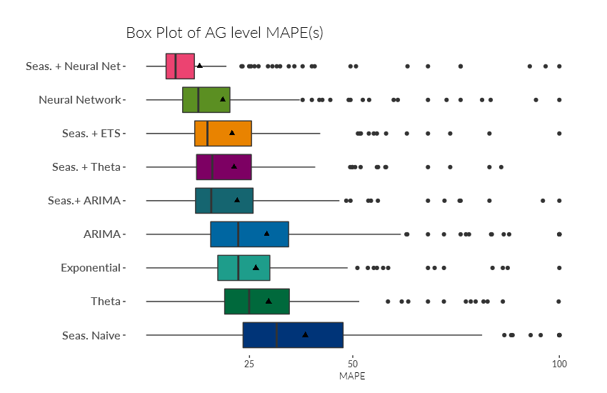
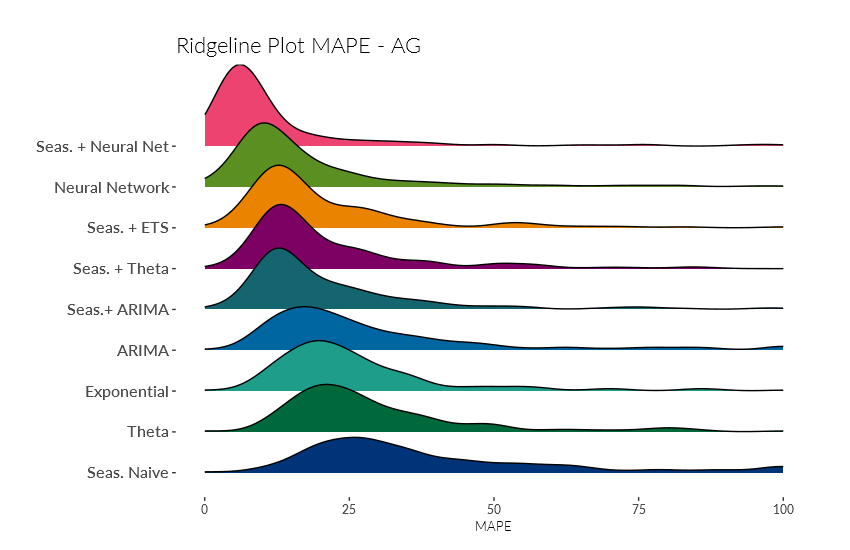
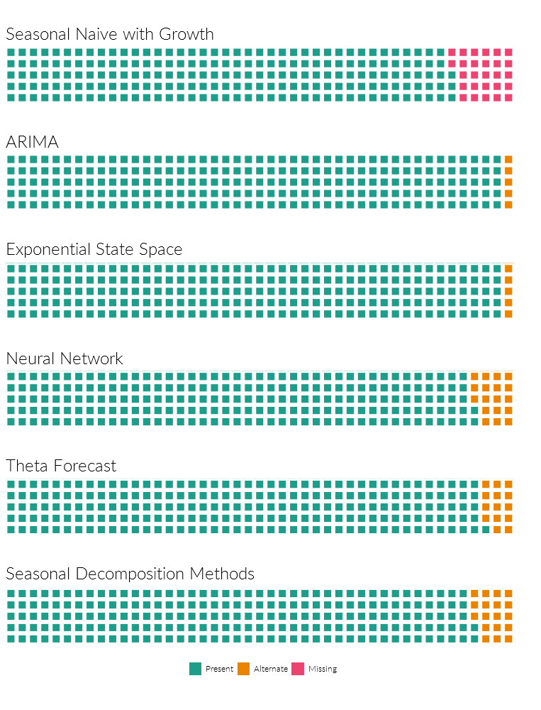

# Time Series Forecasting

An application which works on top of the awesome **forecast** package by Rob Hyndman. I have included another forecasting technique to incorporate one of the business requirement which is called **Seasonal Naive with Growth**. It is basically Seasonal Naive, but the forecast is multiplied by a growth measure.

## Getting Started

Just clone the repo to your local and use the codes. The *forecast_functions.R* is the file with the meat of the repo. The other files are just examples that use the function and other ggplot2 visualizations,

### Prerequisites

Need these packages installed and loaded before running the function.

```
require(dplyr)
require(xts)
require(zoo)
require(tidyr)
require(forecast)
require(ggfortify)
require(ggplot2)
```
## Visualization







## Authors

* **Manu Joseph** 

See also the list of [contributors](https://github.com/your/project/contributors) who participated in this project.

## License

This project is licensed under the MIT License - see the [LICENSE.md](LICENSE.md) file for details

## Acknowledgments

* Hat tip to anyone who's code was used, especially Rob Hyndman who is a rockstar in forecasting
* Inspiration
* etc
